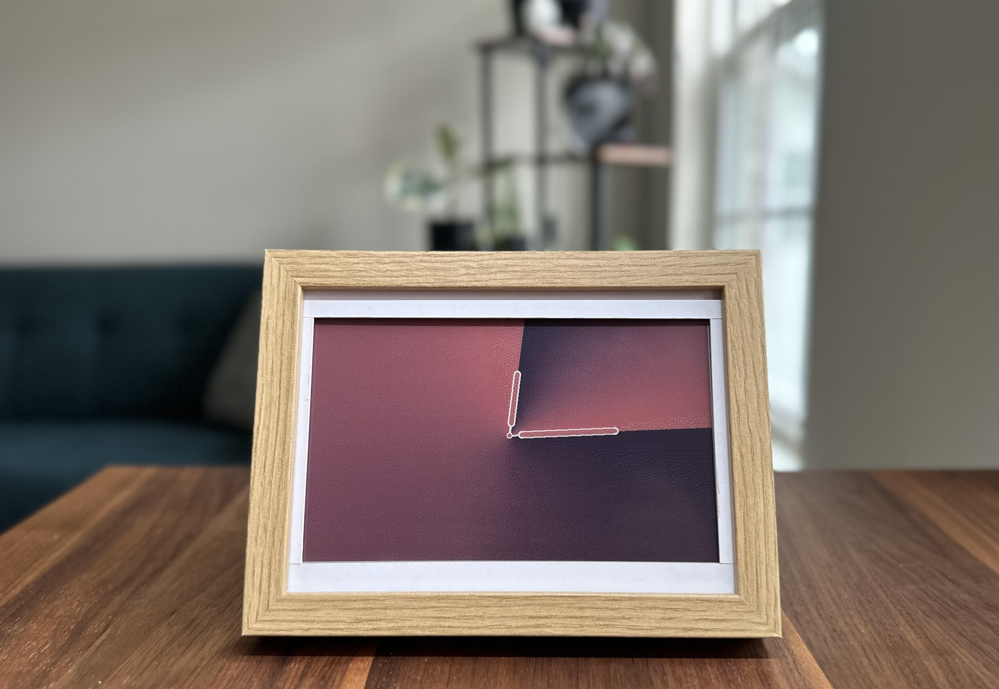

# InkyPi 




## About InkyPi 
InkyPi is an open-source, customizable E-Ink display powered by a Raspberry Pi. Designed for simplicity and flexibility, it allows you to effortlessly display the content you care about, with a simple web interface that makes setup and configuration effortless.

**Features**:
- Natural paper-like aethetic: crisp, minimalist visuals that are easy on the eyes, with no glare or backlight
- Web Interface allows you to update and configure the display from any device on your network
- Minimize distractions: no LEDS, noise, or notifications, just the content you care about
- Easy installation and configuration, perfect for beginners and makers alike
- Open source project allowing you to modify, customize, and create your own plugins
- Set up scheduled playlists to display different plugins at designated times

**Plugins**:

- Image Upload: Upload and display any image from your browser
- Newspaper: Show daily front pages of major newspapers from around the world
- Clock: Customizable clock faces for displaying time
- AI Image: Generate images from text prompts using OpenAI's DALL·E 
- AI Text: Display dynamic text content using OpenAI's GPT-4o text models
- Weather: Display current weather conditions and multi-day forecasts with a customizable layout

And additional plugins coming soon! For documentation on building custom plugins, see [Building InkyPi Plugins](./docs/building_plugins.md).

## Hardware

- Raspberry Pi (4 | 3 | Zero 2 W)
    - Recommended to get 40 pin Pre Soldered Header
- MicroSD Card (min 8 GB)
- E-Ink Display: Inky Impression from Pimoroni, available in 3 sizes (affiliate links)
    - **[7.3 Inch Display](https://collabs.shop/q2jmza)**
    - **[5.7 Inch Display](https://collabs.shop/ns6m6m)**
    - **[4 Inch Display](https://collabs.shop/cpwtbh)**
- Picture Frame or 3D Stand
    - See [community.md](./docs/community.md) for 3D models, custom builds, and other submissions from the community

## Installation
To install InkyPi, follow these steps:

1. Clone the repository:
    ```bash
    git clone https://github.com/fatihak/InkyPi.git
    ```
2. Navigate to the project directory:
    ```bash
    cd InkyPi
    ```
3. Run the installation script with sudo:
    ```bash
    sudo bash install/install.sh
    ```

After the installation is complete, the script will prompt you to reboot your Raspberry Pi. Once rebooted, the display will update to show the InkyPi splash screen.

Note: 
- The installation script requires sudo privileges to install and run the service. We recommend starting with a fresh installation of Raspberry Pi OS to avoid potential conflicts with existing software or configurations.
- The installation process will automatically enable the required SPI and I2C interfaces on your Raspberry Pi.

For more details, including instructions on how to image your microSD with Raspberry Pi OS, refer to [installation.md](./docs/installation.md). You can also checkout [this YouTube tutorial](https://youtu.be/L5PvQj1vfC4).

## Update
To update your InkyPi with the latest code changes, follow these steps:
1. Navigate to the project directory:
    ```bash
    cd InkyPi
    ```
2. Fetch the latest changes from the repository:
    ```bash
    git pull
    ```
3. Run the update script with sudo:
    ```bash
    sudo bash install/update.sh
    ```
This process ensures that any new updates, including code changes and additional dependencies, are properly applied without requiring a full reinstallation.

## Uninstall
To install InkyPi, simply run the following command:

```bash
sudo bash install/uninstall.sh
```

## Roadmap
The InkyPi project is constantly evolving, with many exciting features and improvements planned for the future.

- Plugins, plugins, plugins
- Modular layouts to mix and match plugins
- Support for buttons with customizable action bindings
- Improved Web UI on mobile devices
- Support for Waveshare devices

Check out the public [trello board](https://trello.com/b/SWJYWqe4/inkypi) to explore upcoming features and vote on what you'd like to see next!

## License

Distributed under the GPL 3.0 License, see [LICENSE](./LICENSE) for more information.

This project includes fonts and icons with separate licensing and attribution requirements. See [Attribution](./docs/attribution.md) for details.

## Issues

Check out the [troubleshooting guide](./docs/troubleshooting.md). If you're still having trouble, feel free to create an issue on the [GitHub Issues](https://github.com/fatihak/InkyPi/issues) page.

If you're using a Pi Zero W, note that there are known issues during the installation process. See [Known Issues during Pi Zero W Installation](./docs/troubleshooting.md#known-issues-during-pi-zero-w-installation) section in the troubleshooting guide for additional details..

## Sponsoring

InkyPi is maintained and developed with the help of sponsors. If you enjoy the project or find it useful, consider supporting its continued development.

<p align="center">
<a href="https://github.com/sponsors/fatihak" target="_blank"></a>
<a href="https://www.patreon.com/akzdev" target="_blank"></a>
<a href="https://www.buymeacoffee.com/akzdev" target="_blank"></a>
</p>


## Acknowledgements

Check out these similar projects:

- [PaperPi](https://github.com/txoof/PaperPi) - awesome project that supports waveshare devices
    - shoutout to @txoof for assisting with InkyPi's installation process
- [InkyCal](https://github.com/aceinnolab/Inkycal) - has modular plugins for building custom dashboards
- [PiInk](https://github.com/tlstommy/PiInk) - inspiration behind InkyPi's flask web ui
