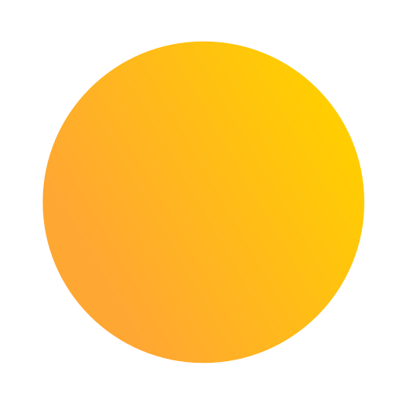
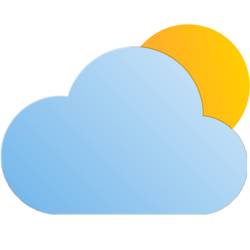
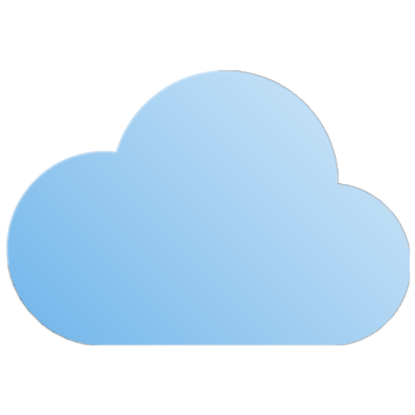
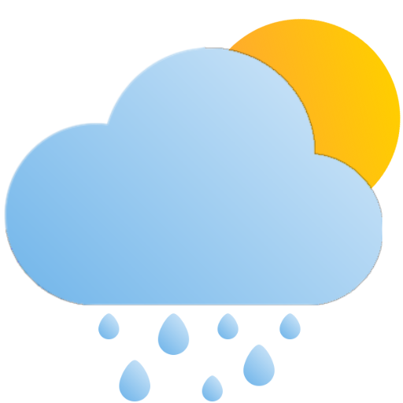
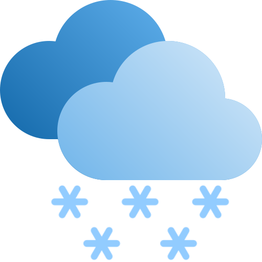
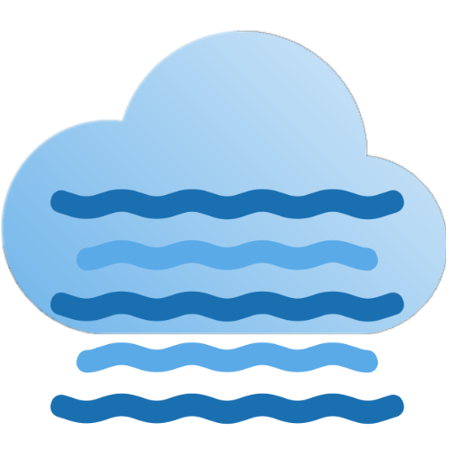
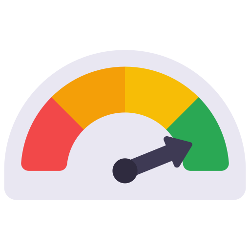
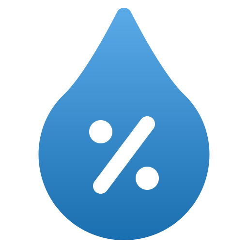
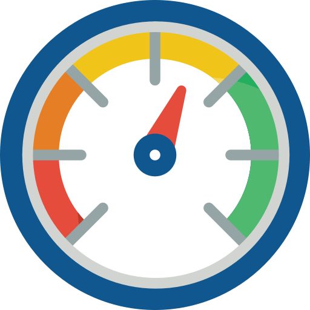

# Attribution
This project uses various fonts and icons, each with specific licensing terms. Below is a breakdown of the sources and their respective licenses. Please ensure compliance with these licenses when using or redistributing the assets.

## Font Faces
| Name | License |
|---------------------------------------------------------------------------------------------------------------|---------------------------------------------------------------------------------------|
[Jost by Owen Earl](https://fonts.google.com/specimen/Jost) | [SIL OFL v1.1](https://fonts.google.com/specimen/Jost/license) |
[Dogica Pixel by Roberto Mocci ](https://www.dafont.com/dogica.font) | [SIL OFL v1.1](http://scripts.sil.org/OFL)|
[DS-Digital by Dusit Supasawat ](https://www.dafont.com/ds-digital.font) | [Shareware](../src/static/fonts/DS-DIGI/DIGITAL.txt)|
[Napoli by Vladimir Nikolic ](https://www.dafont.com/napoli.font) | Free for personal use |

## Icons
| Name | Attribution |
|---------------------------------------------------------------------------------------------------------------|---------------------------------------------------------------------------------------|
|  | <a href="https://www.flaticon.com/free-icons/clock" title="clock icons">Clock icons created by dmitri13 - Flaticon</a>|
|  | <a href="https://www.flaticon.com/free-icons/picture" title="picture icons">Picture icons created by Pixel perfect - Flaticon</a>|
|  | <a href="https://www.flaticon.com/free-icons/paper" title="paper icons">Paper icons created by Freepik - Flaticon</a>|
|  | <a href="https://www.flaticon.com/free-icons/sunny" title="sunny icons">Sunny icons created by kosonicon - Flaticon</a>|
|  | <a href="https://www.flaticon.com/free-icons/music-and-multimedia" title="music and multimedia icons">Music and multimedia icons created by Archival - Flaticon</a>|
|  | <a href="https://www.flaticon.com/free-icons/modify" title="modify icons">Modify icons created by Freepik - Flaticon</a>|
|  | <a href="https://www.flaticon.com/free-icons/picture" title="picture icons">Picture icons created by Pixel perfect - Flaticon</a>|
|  |<a href="https://www.flaticon.com/free-icons/delete" title="delete icons">Delete icons created by Pixel perfect - Flaticon</a>|
|  |<a href="https://www.flaticon.com/free-icons/settings" title="settings icons">Settings icons created by Phoenix Group - Flaticon</a>|
|  | <a href="https://www.flaticon.com/free-icons/gradient" title="gradient icons">Gradient icons created by jeremie ROBERRINI-NEVEU - Flaticon</a>|
|  | <a href="https://www.flaticon.com/free-icons/cloudy" title="cloudy icons">Cloudy icons created by berkahicon - Flaticon</a> <a href="https://www.flaticon.com/free-icons/gradient" title="gradient icons">Gradient icons created by jeremie ROBERRINI-NEVEU - Flaticon</a>|
|  | <a href="https://www.flaticon.com/free-icons/cloudy" title="cloudy icons">Cloudy icons created by berkahicon - Flaticon</a>|
|  | <a href="https://www.flaticon.com/free-icons/cloudy" title="cloudy icons">Cloudy icons created by berkahicon - Flaticon</a>|
|  | <a href="https://www.flaticon.com/free-icons/rainy" title="rainy icons">Rainy icons created by berkahicon - Flaticon</a>|
|  | <a href="https://www.flaticon.com/free-icons/rainy" title="rainy icons">Rainy icons created by berkahicon - Flaticon</a> <a href="https://www.flaticon.com/free-icons/gradient" title="gradient icons">Gradient icons created by jeremie ROBERRINI-NEVEU - Flaticon</a>|
|  |<a href="https://www.flaticon.com/free-icons/thunderstorm" title="thunderstorm icons">Thunderstorm icons created by berkahicon - Flaticon</a>|
|  |<a href="https://www.flaticon.com/free-icons/snow" title="snow icons">Snow icons created by berkahicon - Flaticon</a>|
|  |<a href="https://www.flaticon.com/free-icons/cloudy" title="cloudy icons">Cloudy icons created by berkahicon - Flaticon</a> <a href="https://www.flaticon.com/free-icons/mist" title="mist icons">Mist icons created by Good Ware - Flaticon</a>|
|  |<a href="https://www.flaticon.com/free-icons/speedometer" title="speedometer icons">Speedometer icons created by juicy_fish - Flaticon</a>|
|  |<a href="https://www.flaticon.com/free-icons/humidity" title="humidity icons">Humidity icons created by HJ Studio - Flaticon</a>|
|  |<a href="https://www.flaticon.com/free-icons/pressure" title="pressure icons">Pressure icons created by Smashicons - Flaticon</a>|
|  |<a href="https://www.flaticon.com/free-icons/sunset" title="sunset icons">Sunset icons created by Icon Hubs - Flaticon</a>|
|  |<a href="https://www.flaticon.com/free-icons/sunset" title="sunset icons">Sunset icons created by Icon Hubs - Flaticon</a>|
|  |<a href="https://www.flaticon.com/free-icons/uv-index" title="uv index icons">Uv index icons created by Freepik - Flaticon</a>|
|  |<a href="https://www.flaticon.com/free-icons/observe" title="observe icons">Observe icons created by meaicon - Flaticon</a>|
|  |<a href="https://www.flaticon.com/free-icons/wind" title="wind icons">Wind icons created by riajulislam - Flaticon</a>|

