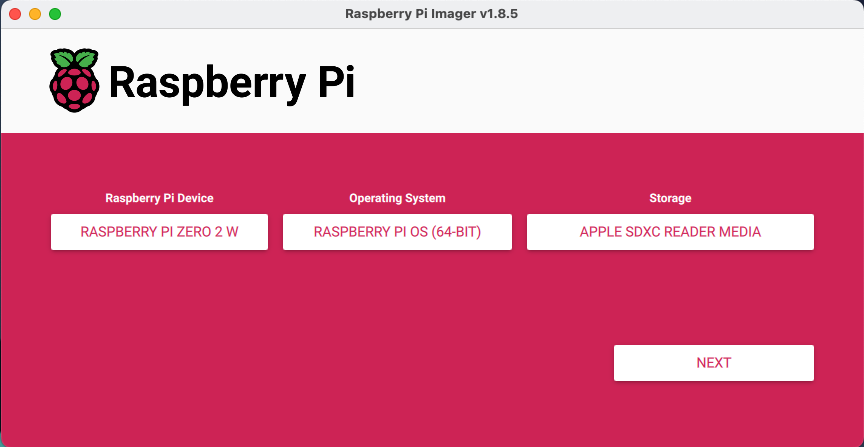
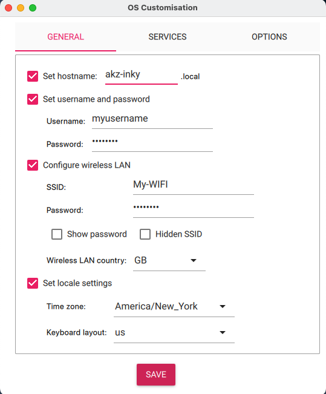
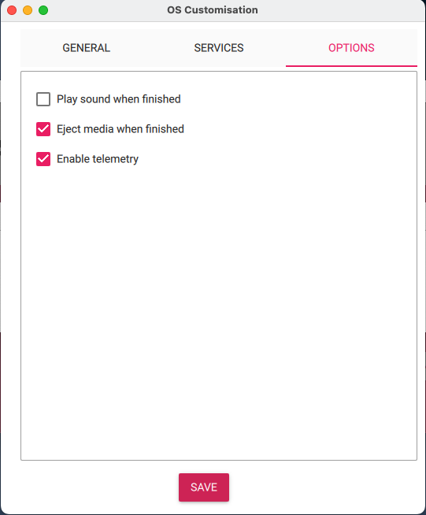
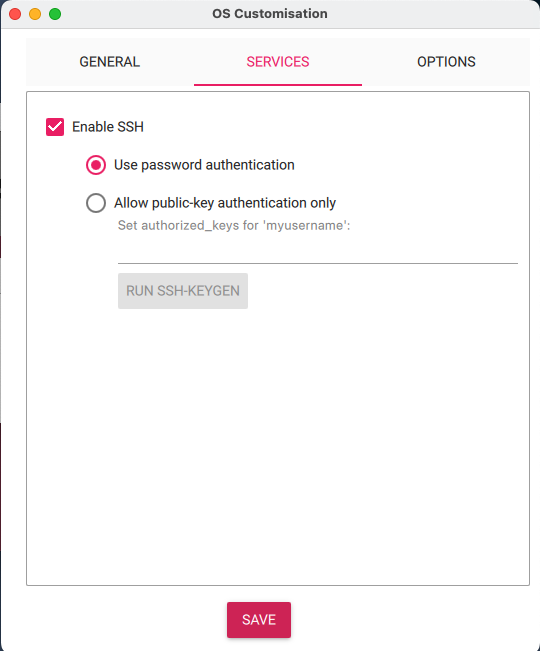

# InkyPi Detailed Installation

## Flashing Raspberry Pi OS 

1. Install the Raspberry Pi Imager from the [official download page](https://www.raspberrypi.com/software/)
2. Insert the target SD Card into your computer and launch the Raspberry Pi Imager software
    - Raspberry Pi Device: Choose your Pi model
    - Operating System: Select the recommended system
    - Storage: Select the target SD Card

3. Click Next and choose Edit Settings on the Use OS customization? screen
    - General:
        - Set hostname: enter your desired hostname
            -  This will be used to ssh into the device & access the InkyPi UI on your network.
        - Set username & password
            - Do not use the default username and password on a Raspberry PI as this poses a security risk
        - Configure wireless LAN to your network
            - The InkyPi web server will only be accessible to devices on this network
        - Set local settings to your Time zone
    - Service:
        - Enable SSH:
            - Use password authentication
    - Options: leave default values

  
   
  

4. Click Yes to apply OS customization options and confirm
